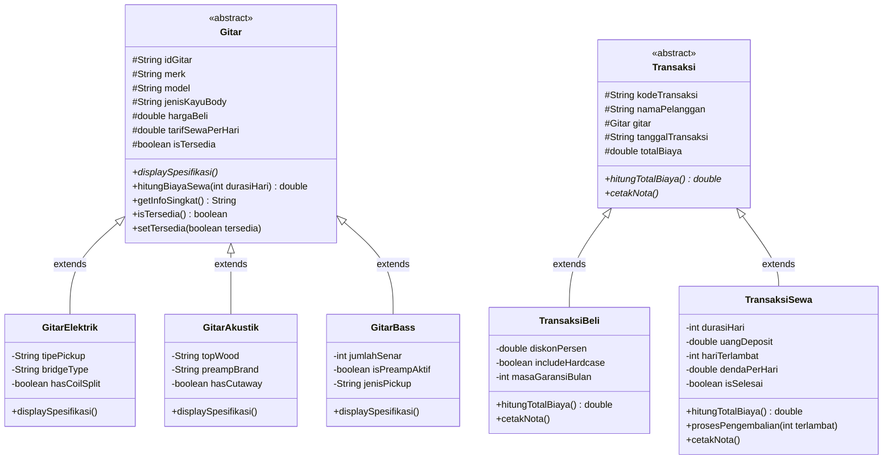

# Tugas Individu: Pemrograman Berorientasi Objek (Java)
## Sistem Manajemen Rental & Penjualan Toko Gitar Custom Shop (CLI)

Program aplikasi berbasis konsol (*Command Line Interface* / CLI) menggunakan bahasa pemrograman Java dengan menerapkan prinsip-prinsip **Pemrograman Berorientasi Objek (PBO)**, khususnya **Inheritance (Pewarisan)**, **Polymorphism (Polimorfisme)**, **Encapsulation (Enkapsulasi)**, dan **Abstraction (Abstraksi)**.

Aplikasi ini dibangun menggunakan struktur standar **Maven Project** yang kompatibel langsung dengan **Apache NetBeans**.

---

## 👤 Identitas Mahasiswa
* **Nama** : Muhammad Fahriel
* **NIM** : 2509116050
* **Kelas / Program Studi** : B'2025 Sistem Informasi
* **Mata Kuliah** : Pemrograman Berorientasi Objek

---

## 📖 Penjelasan Studi Kasus
Studi kasus yang diangkat adalah **Sistem Manajemen Rental & Penjualan pada Toko Gitar Custom Shop**. Toko ini mengelola instrumen musik *high-end* (Gitar Elektrik, Gitar Akustik, dan Bass Elektrik) dengan dua model bisnis utama:

1. **Layanan Penjualan Unit Gitar (Sales)**:
   * Pelanggan dapat membeli gitar custom shop.
   * Mendukung perhitungan diskon member dan opsi penambahan aksesoris *Deluxe Hardcase*.
   * Menyertakan sertifikasi luthier resmi dan masa garansi.
2. **Layanan Penyewaan / Rental Gitar**:
   * Pelanggan dapat menyewa gitar harian untuk keperluan rekaman studio, konser, atau sesi latihan.
   * Menerapkan kalkulasi uang jaminan / deposit pengaman (*refundable*).
   * Status ketersediaan instrumen diperbarui secara otomatis (`TERSEDIA` atau `DISEWA`).
3. **Layanan Pengembalian & Denda**:
   * Menangani pengembalian instrumen yang telah disewa.
   * Menghitung denda keterlambatan secara otomatis berdasarkan hari telat dan memotongnya dari uang deposit.
4. **Pencetakan Nota / Invoice Resmi**:
   * Mencetak bukti transaksi dengan format kuitansi kasir profesional di konsol.

---

## 🏗️ Diagram Kelas & Hierarki Class

Program ini mengimplementasikan **dua rantai pewarisan (Inheritance)**:

### 1. Diagram Hubungan Class (Mermaid)


### 2. Penjelasan Hierarki Class:
1. **Super-Class `Gitar`**:
   * Merupakan *abstract class* yang menjadi cetak biru bagi seluruh instrumen di toko. Menyimpan atribut bersama seperti `idGitar`, `merk`, `model`, `jenisKayuBody`, `hargaBeli`, dan `tarifSewaPerHari`.
2. **Sub-Class `GitarElektrik`, `GitarAkustik`, `GitarBass`**:
   * Mewarisi sifat-sifat dasar dari `Gitar`.
   * Menambahkan atribut spesifik (misal: `tipePickup` pada elektrik, `topWood` pada akustik, dan `jumlahSenar` pada bass).
   * Masing-masing mengimplementasikan method abstrak `displaySpesifikasi()` sesuai karakteristik fisiknya.
3. **Super-Class `Transaksi`**:
   * Merupakan induk bagi setiap transaksi bisnis yang terjadi di toko (`kodeTransaksi`, `namaPelanggan`, objek `gitar`, `tanggalTransaksi`).
4. **Sub-Class `TransaksiBeli` & `TransaksiSewa`**:
   * `TransaksiBeli` mengkhususkan diri pada perhitungan diskon dan garansi.
   * `TransaksiSewa` mengkhususkan diri pada durasi pinjam, uang deposit, serta kalkulasi denda keterlambatan.

---

## 🔍 Penjelasan Bagian Kode Penerapan Inheritance

Penerapan konsep pewarisan (*Inheritance*) dalam kode program dapat ditunjukkan pada bagian-bagian berikut:

### 1. Penggunaan Sintaks `extends`
Pewarisan kelas dilakukan dengan kata kunci `extends`:
* **`GitarElektrik` mewarisi `Gitar`**:
  ```java
  public class GitarElektrik extends Gitar { ... }
  ```
  *(File: `src/main/java/com/customshop/model/GitarElektrik.java`)*
* **`TransaksiBeli` mewarisi `Transaksi`**:
  ```java
  public class TransaksiBeli extends Transaksi { ... }
  ```
  *(File: `src/main/java/com/customshop/model/TransaksiBeli.java`)*

### 2. Penggunaan Kata Kunci `super()`
Konstruktor sub-class memanggil konstruktor milik super-class untuk menginisialisasi atribut turunan:
```java
public GitarElektrik(String idGitar, String merk, String model, String jenisKayuBody, 
                     double hargaBeli, double tarifSewaPerHari, 
                     String tipePickup, String bridgeType, boolean hasCoilSplit) {
    // Memanggil konstruktor super-class Gitar
    super(idGitar, merk, model, jenisKayuBody, hargaBeli, tarifSewaPerHari);
    this.tipePickup = tipePickup;
    this.bridgeType = bridgeType;
    this.hasCoilSplit = hasCoilSplit;
}
```

### 3. Penerapan Polimorfisme (@Override)
Method abstrak pada super-class dioverride secara dinamis oleh sub-class untuk menyesuaikan perilakunya:
```java
@Override
public void displaySpesifikasi() {
    System.out.println(" Kategori     : GITAR ELEKTRIK CUSTOM SHOP");
    System.out.printf(" Tipe Pickup  : %s%n", tipePickup);
    System.out.printf(" Bridge/Trem  : %s%n", bridgeType);
    // ...
}
```

---

## 🚀 Cara Membuka & Menjalankan di Apache NetBeans

1. Buka aplikasi **Apache NetBeans**.
2. Klik menu **File** > **Open Project...** (atau tekan shortcut `Ctrl + Shift + O`).
3. Buka folder:
   ```text
   CustomShopGuitar
   ```
   *(Yang berada di folder default NetBeans Anda: `Documents\NetBeansProjects\CustomShopGuitar`)*.
4. Klik tombol **Open Project**.
5. Jalankan aplikasi dengan menekan tombol **F6** atau tombol panah hijau (**Run Project**) di toolbar.
6. Program CLI akan langsung berjalan di panel **Output** NetBeans.

---

## 🖥️ Tangkapan Layar (Screenshot Running Program)

> *SS*

### 1. Menu Utama & Katalog Instrumen
```text
=================================================================
       🎸  VINTAGE & CUSTOM SHOP GUITAR STORE SYSTEM  🎸        
               Aplikasi Manajemen Rental & Penjualan             
         Tugas Praktikum Pemrograman Berorientasi Objek         
=================================================================

=======================================================
            MENU UTAMA TOKO GITAR CUSTOM SHOP          
=======================================================
 [1] Lihat Katalog Koleksi Gitar (Stok & Harga)
 [2] Cek Spesifikasi Detail Instrumen (Spek Luthier)
 [3] Transaksi Pembelian Unit Gitar
 [4] Transaksi Penyewaan / Rental Gitar
 [5] Pengembalian Gitar Rental & Cek Denda
 [6] Lihat Seluruh Riwayat Transaksi
 [7] Keluar Program
 Masukkan pilihan menu (1-7): 1

=========================================================================================
                     KATALOG KOLEKSI GITAR CUSTOM SHOP PREMIER                           
=========================================================================================
ID      | MERK         | SERI / MODEL                     | HARGA BELI       | SEWA/HARI      | STATUS    
-----------------------------------------------------------------------------------------
EL-01   | Fender       | Custom Shop '60s Stratocaster... | Rp    38.500.000 | Rp    250.000  | [TERSEDIA]
EL-02   | Gibson       | Les Paul Custom 1957 Black Be... | Rp    54.000.000 | Rp    320.000  | [TERSEDIA]
AK-01   | Taylor       | 814ce Grand Auditorium Custom    | Rp    46.000.000 | Rp    280.000  | [TERSEDIA]
AK-02   | Martin       | D-28 Modern Deluxe Custom Shop   | Rp    49.500.000 | Rp    300.000  | [TERSEDIA]
BS-01   | Ernie Ball.. | StingRay Special 5-String Custom | Rp    36.000.000 | Rp    220.000  | [TERSEDIA]
BS-02   | Fender       | Custom Shop '64 Jazz Bass Jou... | Rp    42.000.000 | Rp    260.000  | [TERSEDIA]
=========================================================================================
```

### 2. Transaksi Penyewaan (Rental Contract)
```text
--- TRANSAKSI PENYEWAAN / RENTAL GITAR ---
 Masukkan Nama Penyewa : Farrel
 Masukkan ID Gitar yang ingin disewa: EL-01
 Masukkan Durasi Sewa (dalam hari): 3

 >> Transaksi sewa BERHASIL diproses!
=================================================================
               BUKTI KONTRAK RENTAL GITAR CUSTOM                 
=================================================================
 No. Kontrak Sewa : TRX-RNT-1001
 Tanggal Mulai    : 17-09-2026 06:30
 Nama Penyewa     : Farrel
-----------------------------------------------------------------
 Unit Gitar       : [EL-01] Fender Custom Shop '60s Stratocaster Relic
 Tarif Sewa       : Rp        250.000 / hari
 Durasi Sewa      : 3 Hari
 Subtotal Sewa    : Rp        750.000
 Deposit Jaminan  : Rp        500.000 (Refundable)
-----------------------------------------------------------------
 STATUS RENTAL    : AKTIF (GITAR SEDANG DIPINJAM)
=================================================================
```

### 3. Transaksi Pembelian Unit (Sales Invoice)
```text
--- TRANSAKSI PEMBELIAN GITAR ---
 Masukkan Nama Pelanggan : Farrel
 Masukkan ID Gitar yang ingin dibeli: AK-01
 Masukkan Diskon Member (%) [Ketik 0 jika tidak ada]: 10
 Tambah Deluxe Flight Hardcase (+Rp 750.000)? (y/n): y

 >> Pembelian BERHASIL diproses!
=================================================================
              INVOICE PENJUALAN GITAR CUSTOM SHOP               
=================================================================
 No. Invoice      : TRX-BUY-1002
 Tanggal Transaksi: 17-09-2026 06:35
 Nama Pelanggan   : Farrel
-----------------------------------------------------------------
 Unit Gitar       : [AK-01] Taylor 814ce Grand Auditorium Custom
 Harga Pokok Unit : Rp     46.000.000
 Diskon Promo (10%): -Rp      4.600.000
 Deluxe Hardcase  : Rp        750.000 (Termasuk)
-----------------------------------------------------------------
 TOTAL PEMBAYARAN : Rp     42.150.000
-----------------------------------------------------------------
 Status Garansi   : Sertifikat Luthier Resmi (24 Bulan)
 Catatan          : Gratis 2x Setup & Ganti Senar Pertama.
=================================================================
```
